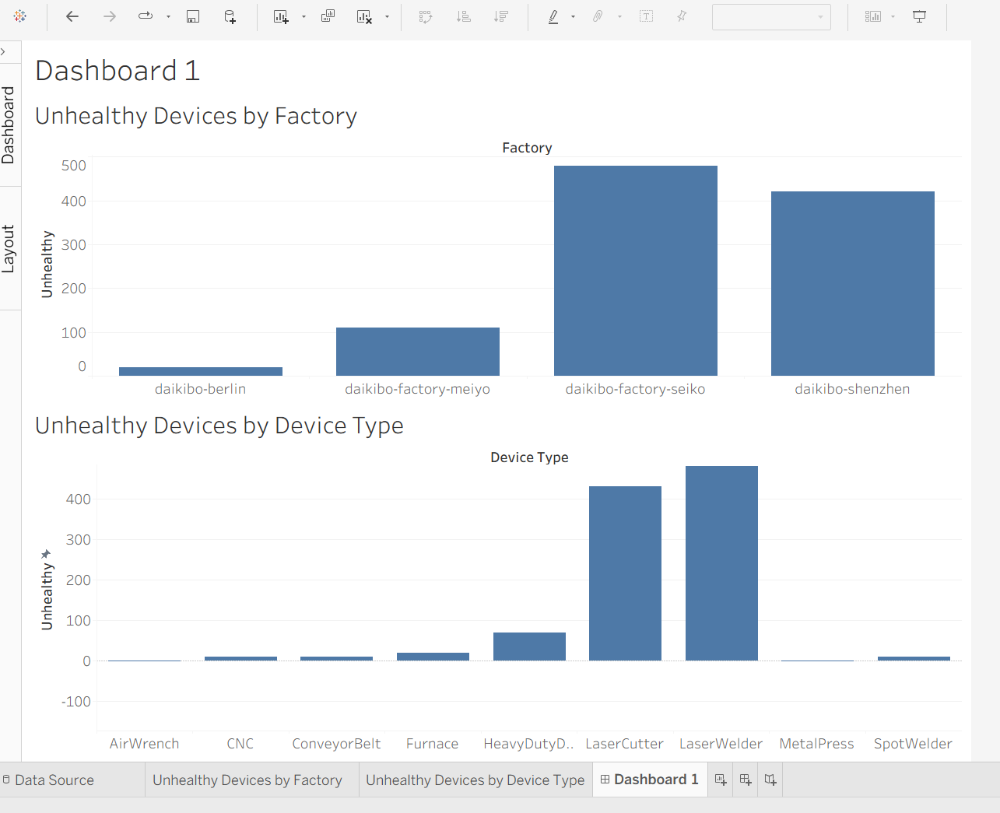

# Deloitte Data Analytics - Tableau Dashboard

## Project Overview

This project was completed as part of the Deloitte Data Analytics job simulation. The project focuses on analyzing Daikibo factory telemetry data using Tableau to identify patterns in device health and factory operations.

## Objective

The objective was to explore telemetry data from Daikibo's manufacturing facilities and create visualizations that help identify unhealthy devices and compare device status across factories and device types.

## Tools Used

- Tableau
- Data Visualization
- Data Analysis
- JSON Dataset

## Analysis Performed

- Analyzed device status across different factories.
- Compared unhealthy device activity across device types.
- Created calculated fields to identify unhealthy device records.
- Used factory-level filtering to explore specific locations.
- Built a Tableau dashboard combining multiple visualizations.

## Dashboard

## Key Skills Demonstrated

- Data exploration
- Data visualization
- Tableau dashboards
- Calculated fields
- Filtering and interactive analysis
- Extracting insights from operational data

## Project Outcome

Created an interactive Tableau dashboard to analyze factory telemetry data and highlight patterns in device health, supporting data-driven understanding of manufacturing operations.
